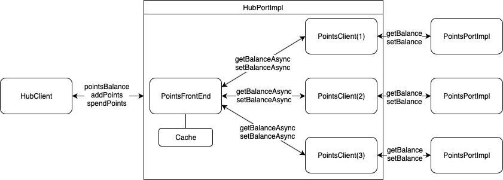

\ 


\newpage

# Modelo de faltas

Segundo o enunciado:

  + Os gestores de réplica podem falhar silenciosamente mas não
    arbitrariamente, i.e., não há falhas bizantinas;
  + No máximo, existe uma minoria de gestores de réplica em falha em
    simultâneo;
  + O sistema é assíncrono e a comunicação pode omitir mensagens
    (apesar do projeto usar HTTP como transporte, deve assumir-se que
    outros protocolos de menor fiabilidade podem ser usados)


Na nossa implementação, as falhas silenciosas toleradas são, por exemplo:

  + Não estar inscrito no _UDDI_
  + Estar inscrito no _UDDI_, mas demorar tempo indeterminado a responder


# Solução de tolerância de faltas



A nossa solução passa por utilizar o algoritmo _Quorum Consensus_, onde:

  - Cada gestor de réplica é um servidor de pontos com a informação de
    todos os clientes do _Hub_.
  - O _Front End_ garante que só há **um** acesso (leitura ou escrita) para o
    valor de pontos para cada cliente, e portanto os servidores de pontos
    não terão mecanismos para garantir que não há acessos concorrentes do
    mesmo valor (i.e., a consistência sequencial do protocolo é
    assegurado somente no _Front End_).

Em termos concretos, a classe `PointsFrontEnd` dentro do módulo `pts-ws-cli` é
que implementa os métodos `read` e `write` necessários para o _Quorum Consensus_,
encapsulando assim a utilização deste protocolo; e para ainda tornar esta mudança
menos drástica em termos de alteração de código, o `PointsFrontEnd` implementa
a antiga interface do `PointsClient`[^exc].

\clearpage

Por exemplo, o spendPoints agora é implementado assim (pseudo-código):

```python
def spendPoints(user, pointsToSpend):

    lock()
    taggedBalance = read(user)

    if balance.points < pointsToSpend:
        throw NotEnoughPointsException

    taggedBalance.points -= pointsToSpend
    taggedBalance.tag += 1

    write(user, taggedBalance)
    unlock()
```

[^exc]: Na implementação, foi necessário alterar as exceções e alguns testes,
        uma vez que não podemos assumir que um utilizador não existe só porque
        não se encontra registado nas múltiplas réplicas.

Este protocolo garante consistência sequencial.


# Optimizações & Simplificações

  - As mensagens trocadas entre o _Front End_ e os gestores de réplica
    contêm o número de pontos e um número de sequência. Não existe
    campo para identificar o _Front End_, porque neste caso o _Front End_
    é único.
  - O _Front End_ pode fazer vários pedidos assíncronos a um mesmo servidor de
    pontos, mas os ditos pedidos são acerca de clientes diferentes.
    O servidor de pontos pode tratar destes pedidos de forma paralela.
  - Se forem acerca do mesmo cliente, o _Front End_ possui um mecanismo de
    _locks_ que garante a consistência e permite a existência de múltiplos
    leitures ou um escritor (implementado utilizando `ReadWriteLock`).
  - O _Front End_ tem um mecanismo de _cache_, que minimiza os acessos
    necessários aos gestores de réplicas. Sendo assim, estes (os
    gestores de réplica) funcionam como _fallback_, caso o valor pretendido
    não esteja na dita _cache_. Caso houvesse a possibilidade de haver 2
    _Front Ends_ a realizarem operações ao mesmo tempo, seria necessário
    implementar um mecanismo de invalidação de _cache_.
  - Caso o _Front End_ detete que só consegue contactar uma minoria de
    gestores de réplica (o que não é tolerável de acordo com o nosso
    modelo de faltas), é mandada uma `RuntimeException` e a operação não é realizada.


O método de chamadas assíncronas utilizado foi _polling_, por uma questão
de simplicidade na implementação. Tendo mais tempo, seria preferível utilizar
uma solução de _callback_, porque permitiria evitar _busy waiting_ da _thread_
principal, evitando assim desperdício em termos de trabalho realizado.

\clearpage

# Protocolo

\begin{wrapfigure}{l}{0.5\textwidth}
\includegraphics[width=0.5\textwidth]{message}
\caption{Troca de mensagens durante um \texttt{spendPoints}}
\end{wrapfigure}

Remoção de pontos:

  - o `FrontEnd` envia pedidos de leitura aos `N` servidores de pontos
  - cada servidor de pontos responde com os números de pontos e versão
    armazenados para esse utilizador
  - o `FrontEnd` espera por `(N/2)+1` respostas, e vai guardando o maior
    número de versão observado e respetivo valor.
  - depois de ter as respostas, o `FrontEnd` verifica que o balance é suficiente,
    senão lança uma exceção `NotEnoughPointsException`.
  - se puder, subtrai os pontos, incrementa por 1 a versão e manda `N` pedidos de escrita
  - Após ter `(N/2)+1` confirmações, retorna.

Os pedidos `getBalance` podem ser evitados se o `FrontEnd` tiver feito uma leitura recente,
tendo portanto o valor dessa leitura em _cach